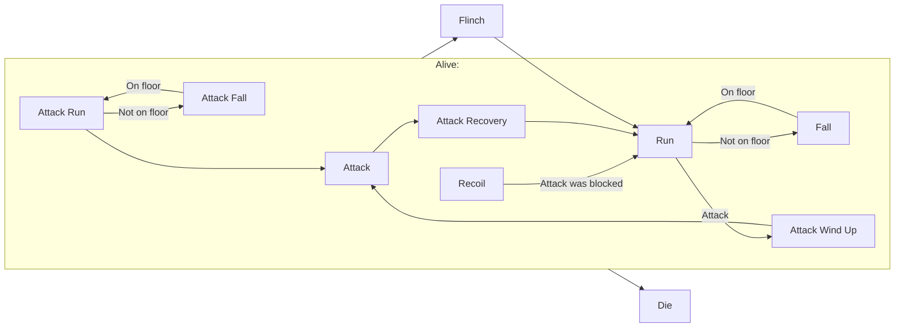
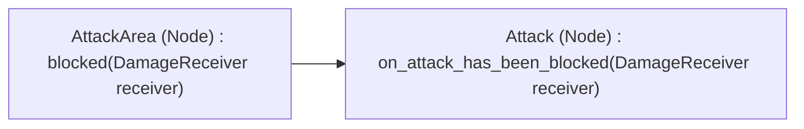

# PuppetCharacter

## Description

A Puppet is a Walking Enemy. It can execute a normal and a run attack.

## Property Descriptions

 ### exports

 - NodePath **attack_area_path**

   The path to the used DamageEmitter used for a Attack. Gets set once on **_ready()** .

 - DamageEmitter **attack_area**

   The DamageEmitter used for a Attack.

 - bool **is_winding**

   If **true** the puppet is winding up for a run attack.

## Method Descriptions

 ### public

  - void **attack( )**
  
    The puppet executes a attack by calling this.

## Node Composition

- PuppetCharacter [PuppetCharacter]
    - Sprite [Sprite] (inherited)
    - HealthBar [HealthBar]
    - Shape [CollisionShape2D] (inherited)
    - HitBox [DamageReceiver] (inherited) 
        - Shape [CollisionShape2D]
    - AttackArea [DamageEmitter]
    - BackFloorDetectionRay [RayCast2D]
    - StateMachine [StateMachine]
        - AttackWindUp [PuppetAttackWindUp] 
        - AttackRun [AttackRun]
        - AttackFall [AttackFall]
        - Attack [Attack]
        - Recoil [Recoil]
        - AttackRecovery [AttackRecovery]
        - Run [PuppetRun]
        - Fall [Fall]
        - Flinch [Flinch]
        - Die [Die]
    - AnimationPlayer [AnimationPlayer] (inherited)

 ### HealthBar

  Graphical element displaying the puppets health.

 ### AttackArea

  DamageEmitter used for executing attacks.

 ### BackFloorDetectionRay

  Raycast2D used to detect the floor to prevent flinching over edges.

 ### StateMachine

    Runs this logic:

## Signal Connections

