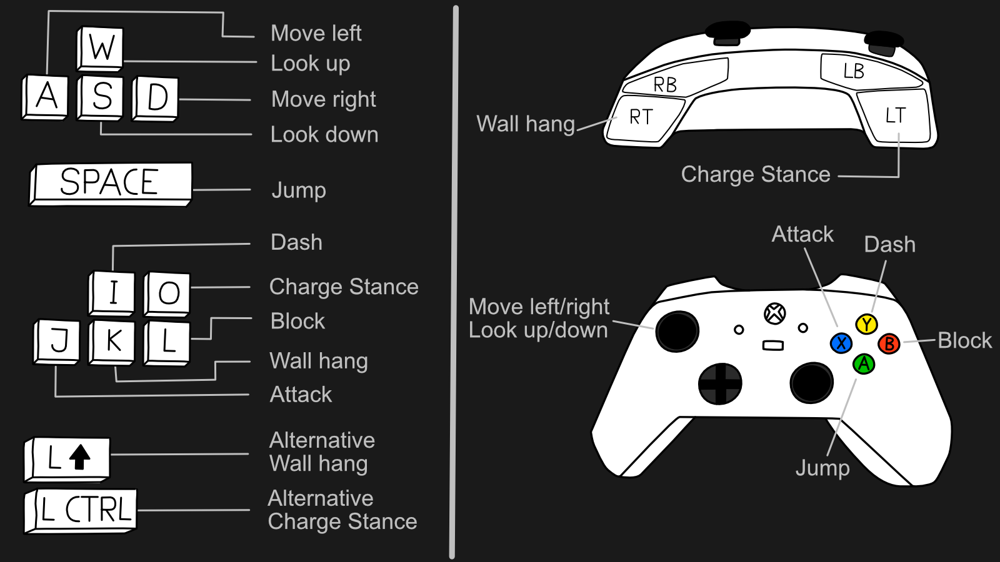
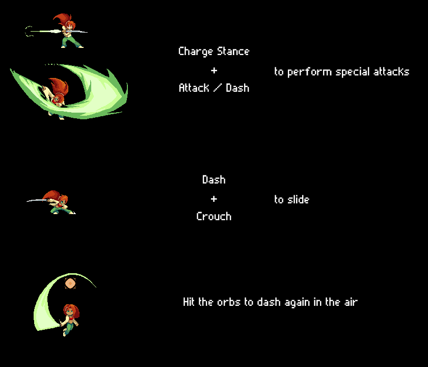

# Epiales

**Beschreibung**

Luci schreckt aus ihrem Traum auf. Schweißgebadet. Wieder einer dieser Albträume. Ständig träumt sie von Monstern und einer finsteren Gestalt die sie Epiales nennt.
Mit allen Mitteln versucht sie gegen ihre Albträume anzukämpfen um endlich mal eine Nacht durchschlafen zu können. Dabei lernt sie die Kunst des luziden Träumens und hat so die Chance das Albtraumwesen Epiales in die Knie zu zwingen um so ihre Albträume ein für alle mal hinter sich zu lassen.

Epiales ist ein Sidescrolling-Action-Jump-and-Run-Spiel mit Nahkampfsystem. In den Leveln wechseln sich ruhige Jump-and-Run-Sektionen mit hektischen Kampf-Sektionen ab.
Die Besonderheit: Es gibt keine Lebensleiste, sondern das Albtraummeter. Dieses füllt sich automatisch wenn Gegner in der Nähe sind und wenn Luci Schaden nimmt. Es leert sich, wenn Luci Schaden austeilt. Wenn es vollgelaufen ist, ist Luci so panisch, dass sie davon aufwacht und das Spiel verloren ist.

Ziel dieser Produktion war es, die Spielmechanik von Luci auf ein stabiles Niveau zu bringen, und der Demo-Level dient dazu, diese Mechaniken zu demonstrieren. Es ist geplant, die Produktion in einem zweiten Semester fortzusetzen, in dem wir uns auf Inhalte rund um Luci konzentrieren werden, wie z. B. ein interaktives Level und mehr Gegnervarianten mit mehr Interaktionsmöglichkeiten.

**Team**

Niels Adam, Theresa Batz, Marco de Jesus António, Simon Marc Geupel, Mario Krupinski, Enji Maaroufi, Larissa Munz, Lena Sophie Musse, Jonas Seidl, Marian Syska, Evgin Talyatov Hyusmenov, Lucie Tischer, Tina Truong, Jeremias Wax, Tomás Zlatovsky, Emre Kabasakal

**Controls**

**Instructions**

